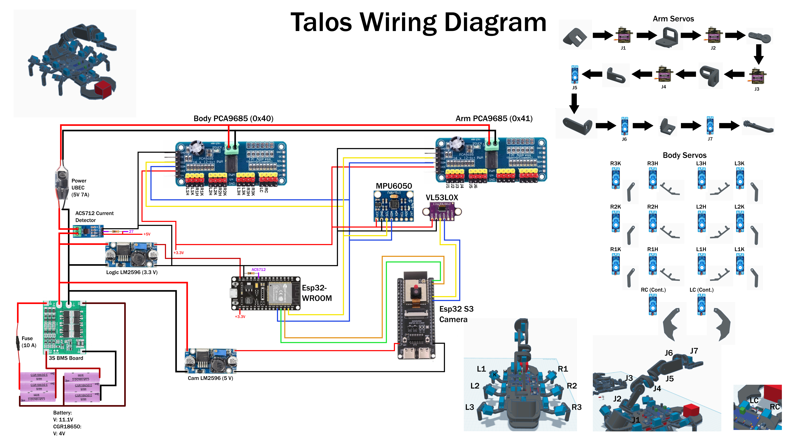
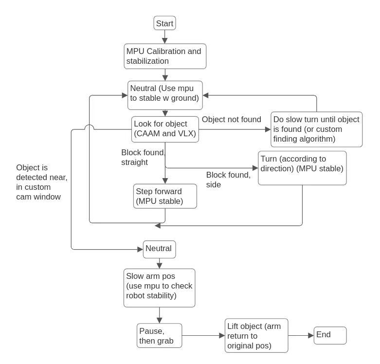

# Project Talos


Scorpion-style hexapod with a 3-DOF arm and computer vision. Wanted to build something that required real-time control, inverse kinematics, and vision processing on embedded hardware. Runs on dual ESP32s (WROOM for motors, S3 for camera) with bare metal C and FreeRTOS.


[![Gait Demo]](https://github.com/user-attachments/assets/25aa7fce-c83b-4c4d-9409-9fcc3f92da20)

## Status

- Arm kinematics (tested, working)
- Walking gait (tested, working)
- Simulator is demoable (tripod/wave/ripple, arm IK, physics ball)
- Full RTOS architecture
- Some sensors (MPU6050, ACS712, ToF) not wired up yet
- Waiting on new ToF Sensor
- End-to-end autonomous demo (end goal)

---

## Simulator


**[Try it live →](https://huggingface.co/spaces/vy739/talos-lightsim)**

Lightsim is a browser-based simulator that compiles the real firmware C code natively on Linux using HAL stubs, then visualizes the robot over WebSocket. The actual `main.c`, gait, balance, arm, and IK run unmodified + the 6 hardware drivers (I2C, servo, MPU6050, ADC, UART, power monitor) are stubbed out.

```bash
cd sim/lightsim
./scripts/build.sh   # build C sim + install npm deps
./scripts/run.sh     # launch sim + server on :3000
```

Open `http://localhost:3000`

Three view modes: **Debug** (servo/IMU/I2C dashboard), **2D** (top-down canvas), **3D** (Three.js with orbit camera). D-pad/keyboard control, gait selector, manual arm sliders, IK cursor mode, physics ball.

---

## Hardware

| Component | Details |
|---|---|
| Legs | 6× SG90 + 6× MG90 servos (tripod gait) |
| Arm | 3× MG90S (high-torque joints) + 2× gripper SG90 |
| Servo control | 2× PCA9685 I2C, burst-mode writes |
| Vision MCU | ESP32-S3-CAM + OV2640 |
| Ranging | VL53L0X ToF |
| IMU | MPU6050 |
| Current sensing | ACS712 |
| Power | 3S2P 18650 + BMS, UBEC for servo rail, buck converters for logic |




---

## Firmware

- ESP-IDF with FreeRTOS
- Hardware I2C (burst mode for real-time walking)
- UART for ESP32↔ESP32 comms
- Inverse kinematics for arm
- HSV color blob detection for vision

### RTOS Architecture

There are two ESP32s, each communicating via UART. One manages just the camera and ball detection, and the other manages everything else: state machine, servo commands, etc.

I used FreeRTOS because concurrent tasks let everything run in real time. Instead of a linear system where tasks block each other, most of the state updates happen in parallel. Deciding what gets a task was simple: figure out what needs to run at the same time, assign priorities, map out shared resources, then wire up queues and semaphores where ordering matters.


**Shared IPC** - `task_config.h`
```c
QueueHandle_t     xCamFrameQueue;      // depth=1, stale frames are worse than no frames
QueueHandle_t     xPowerEventQueue;    // depth=4
SemaphoreHandle_t xArmSemaphore;       // binary, arm wakes only when state machine signals
SemaphoreHandle_t xI2CMutex;           // binary, guards PCA9685 bus
TaskHandle_t      xUartCamTaskHandle;  // direct notify via cam ping
```


---

### Tasks

**State machine** `P4 · 50ms` - the essential task that manages everything in the system. It is the one that manages the camera ping every time it cycles through. It is the middle layer that manages the input from the camera and the power monitoring task. It decides what gait state for it to be in, decides positioning of arm, processes the ball detection data, and decides if the power is supposed to be in emergency state or not.

**UART cam** `P3 · 50ms (indirect)` - simple: it will get called via `xUartCamTaskHandle` from the state machine, then it will send a distinct signal via UART to the ESP32-S3-CAM, and then it will await the full packet response, and parse with `bUARTProtoFeedBuf`. It will then send the information back into the state machine via a frame queue (only holds one frame to prevent stale frames) for it to process.

**Gait** `P5 · 20ms` - updates the gait state every 20ms to keep the gait up and running asynchronously while the state machine regularly changes the state. The update command decides gaits for legs, computes new targets and new states for each one. Gait has many types, including wave, ripple, and tripod, with speed being configurable in the update (speed should go down as ball gets closer). Requires I2C bus mutex in order to send commands.

**Balance** `P5 · 20ms` - can be enabled or disabled depending on whether the MPU6050 is detected at startup. It has the same priority as gait (5) and runs on the same 20ms cycle. It reads the MPU6050 and runs a complementary filter with gyro and accel to get pitch and roll, then computes per-leg knee corrections based on the tilt. Gait pulls those corrections directly on its next update, writing to its own internal struct and gait reads it. Some tolerance is built in so small tilts don't cause constant micro-adjustments.

**Arm** `P6` - needs a semaphore to be given from the state machine, where the task will then wake and take ball positioning info from the state machine, where it will then convert the coordinates relative to the arm, then process how to move the arm with IK. Because it has priority 6, it will have highest priority, and it will keep updating the arm to slowly move closer to target. Once target is reached, it will grab. Camera should also keep monitoring the ball and sending updated coordinates to the arm, where it will continuously update the IK of the arm and slowly move to the desired position. Requires I2C bus mutex in order to send commands.

**Power monitor** `P1 · 20ms` - runs in the background every 20ms at priority 1. It reads the ACS712 current sensor and uses a consecutive-count filter. To prevent false positives, it needs 2-3 high readings in a row before flagging a problem, which filters out normal servo inrush spikes that can read way above normal for a short burst on startup. When it does detect a real issue, it escalates its own priority up to the max so it can immediately post the emergency status to the queue without waiting behind any other task. The state machine picks it up at the top of its next 50ms cycle and transitions to EMERGENCY.

**Vision task (S3-CAM)** - will receive the unique ping, register that as a signal, and then run the task based on it. It will snap a picture quickly, then detect any red centroid objects in the frame and compute the centroid position and apparent pixel radius. The VL53L0X is read every frame to get a raw distance measurement. The pixel radius and TOF distance are sent separately in the packet rather than being fused, because the pixel-based distance estimate is noisy and not reliable enough to use for actual approach control. The WROOM side treats them differently: pixel radius is only used to scale turn speed during alignment, and the raw TOF reading is the only thing that drives approach speed and stop decisions.

---

## Logic Flow

```
BOOT -> IDLE -> SEARCH -> ALIGN -> APPROACH -> GRAB -> DONE
                   ^         ^        |
                   |         +--------+ (TOF spike or drift)
                   |
              EMERGENCY (any state, power fault)
```





Robot boots up, the hardware is all initialized in main, and then all tasks are launched.

The state machine is where it starts, and initializes everything else in the tasks, calibrates balancing and others, then idles for a bit before entering search mode.

Once the frame is processed, it will enter searching mode, where the robot will try to find the ball by turning 360.

Gait is used heavily for all walking, and it has auto balance too to make sure the robot is always oriented upwards properly.

Once ball is located, it will transition to aligning, then approaching. During alignment, the camera is used purely for centering: the pixel radius of the blob sets the turn speed (bigger blob means the ball is close, so it turns slower for precision), but no distance math from the camera is used at all since that estimate fluctuates too much in practice.

Once centered, the robot switches to approach mode and walks toward the ball. Speed is controlled by the VL53L0X TOF reading, which is the only accurate distance source. If TOF isn't hitting the ball yet, it creeps forward slowly until it does. If the TOF reading suddenly spikes (meaning the ball has left the sensor beam), it transitions back to align to use the camera for micro adjustments to re-center and re-acquire. Camera is also still watching to catch large centering drift and kick back to align if needed.

Once it's close enough, the robot stops and transitions to grab phase where the arm takes over.

Arm grabs, lifts, and holds. Program is done, robot stays in DONE state.

There is also power monitoring at all times to halt the robot when it detects sustained overcurrent (multiple consecutive bad readings, not just a spike).

---

## Goals

- 50Hz locomotion control
- <5ms IK solve time
- 10Hz vision processing
- Autonomous ball retrieval

---

## Build / Flash

```bash
get_idf
cd firmware/esp
idf.py build
idf.py -p /dev/ttyUSB0 flash monitor
```

---

## Structure

```
Project_Talos/
├── firmware/
│   ├── esp/                        # WROOM firmware (motors, state machine)
│   │   └── main/
│   │       ├── main.c
│   │       ├── tasks/              # FreeRTOS task layer + task_config.h
│   │       ├── state_machine/
│   │       ├── locomotion/         # gait + balance
│   │       ├── arm/                # arm control + IK
│   │       ├── power/
│   │       └── uart_protocol/
│   └── espcam/                     # S3 firmware (camera + vision)
│       └── main/
│           ├── tasks/              # vision_task (ping-driven)
│           ├── vision/             # OV2640 + blob detection + VL53L0X
│           └── uart_protocol/
├── hardware/                       # wiring diagrams, CAD
└── sim/lightsim/                   # browser simulator
    ├── sim/                        # C simulator + HAL stubs
    ├── server/                     # Node.js bridge (Express + ws)
    ├── frontend/                   # vanilla JS, Three.js
    └── scripts/
```
