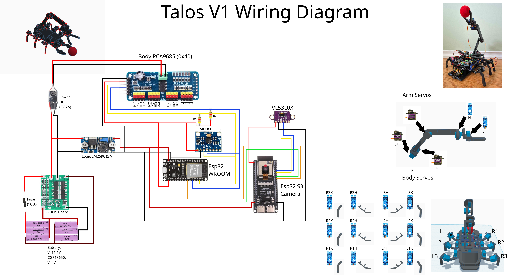
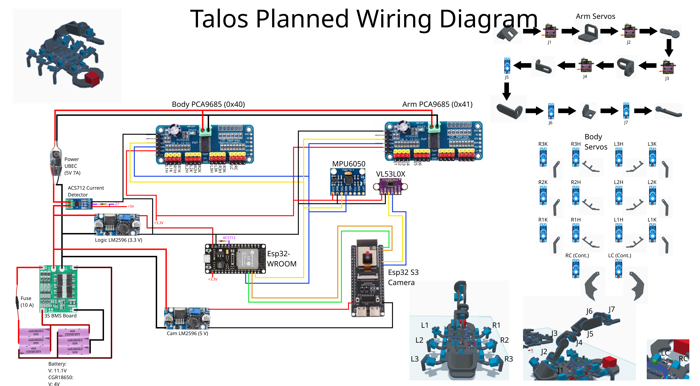
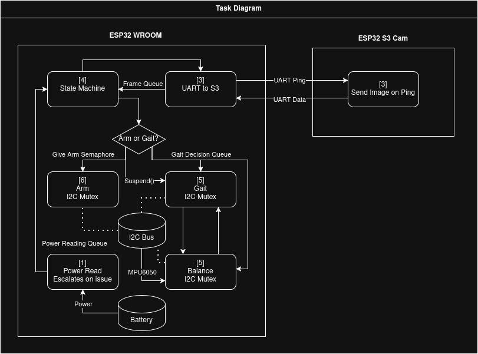

# Project Talos


Scorpion-style hexapod with a 3-DOF arm and computer vision. Built to tackle real-time control, inverse kinematics, and vision processing on embedded hardware. Runs on dual ESP32s (WROOM for motors, S3 for camera) in bare-metal C with FreeRTOS.


[](https://github.com/user-attachments/assets/300aa188-63e3-4abd-8114-233ddaa06847)

---

## Status

| Feature | Status |
|---|---|
| Walking gaits (tripod / wave / ripple) | ✅ Done |
| Arm IK solver | ✅ Done |
| HIL simulator (real firmware + Three.js) | ✅ Done |
| RTOS architecture (6 tasks, queues, mutexes) | ✅ Done |
| Live Working Demo | ✅ Done |
| Extra Sensor integration (MPU6050, ACS712) | 🔧 Firmware ready, not yet wired |

---

## Simulator


**[Try it live →](https://huggingface.co/spaces/vy739/talos-lightsim)**

Lightsim is a browser-based HIL simulator. The real firmware (`main.c`, gait, balance, arm, IK) compiles unmodified on Linux against HAL stubs, then streams state over WebSocket to a Three.js frontend.

**The 6 stubbed drivers:** I2C, servo, MPU6050, ADC, UART, power monitor.

```bash
cd sim/lightsim
./scripts/build.sh   # build C sim + install npm deps
./scripts/run.sh     # launch sim + server on :3000
```

Open `http://localhost:3000`

Three view modes: **Debug** (servo/IMU/I2C dashboard), **2D** (top-down canvas), **3D** (Three.js orbit camera). Controls: D-pad/keyboard, gait selector, manual arm sliders, IK cursor mode, physics ball.

---

## Hardware

| Component | Details |
|---|---|
| Legs | 6x SG90 + 6x MG90 servos |
| Arm | 3x MG90S (joints) + 1x SG90 (gripper) |
| Servo control | 2x PCA9685 (planned, now 1x) over I2C, burst-mode writes |
| Vision MCU | ESP32-S3-CAM + OV2640 |
| Ranging | VL53L0X ToF |
| IMU | MPU6050 (Planned) |
| Current sensing | ACS712 (Planned) |
| Power | 3S2P 18650 + BMS, UBEC for servo rail, buck converter to 5V for logic |




---

## Firmware

Built on ESP-IDF with FreeRTOS. Key design choices:
- Hardware I2C with burst mode for real-time servo updates
- UART bridge between the two ESP32s
- Analytic 3-DOF IK solver for the arm
- HSV blob detection for vision

### RTOS Architecture

Two ESP32s communicate over UART. The S3-CAM handles camera and ball detection only. The WROOM handles everything else: state machine, gait, arm, balance, and power monitoring.

Tasks were assigned based on what needs to run concurrently. Priorities reflect real-time constraints. Shared resources are protected by mutexes and semaphores.

**Shared IPC** (`task_config.h`)

```c
QueueHandle_t     xFrameQueue;         // depth=1, stale frames are worse than no frames
QueueHandle_t     xPowerQueue;         // depth=4
SemaphoreHandle_t xArmSemaphore;       // binary, arm wakes only when state machine signals
SemaphoreHandle_t xI2CMutex;           // binary, guards PCA9685 bus
TaskHandle_t      xUartCamTaskHandle;  // direct notify via cam ping
```



### Tasks

**State machine** `P4 · 50ms`
The central coordinator. Pings the camera every cycle, processes ball detection data and power status, decides gait state and arm positioning, and drives state transitions. The only task that runs the IK solver and calls `xArmSetAngles()`.

**UART cam** `P3 · event-driven`
Triggered by direct-to-task notification from the state machine. Sends a ping over UART to the S3-CAM, waits for the full packet, parses it with `bUARTProtoFeedBuf`, and posts to `xFrameQueue` (depth 1, so stale frames are always dropped).

**Gait** `P5 · 20ms`
Updates leg targets every 20ms asynchronously while the state machine changes gait state independently. Handles tripod, wave, and ripple gaits with configurable speed. Requires the I2C mutex to write servo commands.

**Balance** `P5 · 20ms`
Optional, enabled only if MPU6050 is detected at startup. Reads the IMU, runs a complementary filter (gyro + accel) to get pitch and roll, and computes per-leg knee corrections. Gait reads those corrections on its next update. Dead-banding is built in to avoid constant micro-adjustments on small tilts.

**Arm** `P6 · event-driven`
Gates on `xArmSemaphore`. Wakes when the state machine enters `GRAB_PREP` and runs `xArmUpdate()` each cycle, stepping joints toward their targets at a fixed rate (0.5 deg/step for shoulder, elbow, and base; 4 deg/step for the gripper). Requires the I2C mutex to write servo commands.

**Power monitor** `P1 · 20ms`
Background task reading the ACS712. Uses a consecutive-count filter (2-3 high readings required) to reject servo inrush spikes. On a real fault, escalates its own priority to max to immediately post emergency status to `xPowerQueue`. The state machine picks it up at the top of its next cycle and transitions to `EMERGENCY`.

**Vision task (S3-CAM)** `event-driven`
Wakes on UART ping. Snaps a frame, detects red centroids via HSV blob detection, computes centroid position and apparent pixel radius, and reads the VL53L0X for raw distance. Pixel radius and ToF distance are sent separately in the packet. On the WROOM side, pixel radius only scales turn speed during alignment; ToF is the sole source of truth for approach speed and stop decisions.

---

## Logic Flow

```
BOOT -> CALIBRATE -> IDLE -> SEARCH -> ALIGN -> APPROACH -> GRAB_PREP -> GRAB -> LIFT -> DONE
                               ^          ^         |
                               |          +---------+  (ToF spike or centroid drift)
                               |
                          EMERGENCY  (any state, sustained overcurrent)
```

**BOOT / CALIBRATE:** Hardware init, task launch, MPU6050 calibration hold.

**SEARCH:** Robot turns slowly scanning for the ball. Transitions to `ALIGN` if ball is off-center, or straight to `APPROACH` if already centered.

**ALIGN:** Camera-only centering. Pixel radius of the blob scales turn speed (bigger = closer = slower turns for precision). No distance math from the camera.

**APPROACH:** Walks toward the ball. Speed driven by ToF exclusively. If ToF loses the ball (spike), transitions back to `ALIGN`. Camera drift also triggers a return to `ALIGN`.

**GRAB_PREP:** Robot stops. Arm semaphore is released. State machine runs IK using ToF distance and camera pixel position, sets arm target angles, and waits for the arm to reach position.

**GRAB:** Gripper closes. Transitions to `LIFT` once all joints hit target.

**LIFT:** Shoulder returns to neutral with gripper closed. Transitions to `DONE`.

**DONE:** Hold position. Mission complete.

**EMERGENCY:** Triggered from any state on sustained overcurrent. Power monitor self-escalates priority to guarantee delivery.

---

## Performance

| Goal | Target | Result |
|---|---|---|
| Locomotion update rate | 50 Hz | Met |
| IK solve time | < 5ms | Met |
| Vision processing rate | 10 Hz | Met |
| Autonomous ball retrieval | End-to-end | Met |

---

## Build & Flash

```bash
get_idf
cd firmware/esp
idf.py build
idf.py -p /dev/ttyUSB0 flash monitor
```

---

## Project Structure

```
Project_Talos/
├── firmware/
│   ├── esp/                        # WROOM (motors, state machine)
│   │   └── main/
│   │       ├── main.c
│   │       ├── tasks/              # FreeRTOS tasks + task_config.h
│   │       ├── state_machine/
│   │       ├── locomotion/         # gait + balance
│   │       ├── arm/                # arm control + IK
│   │       ├── power/
│   │       └── uart_protocol/
│   └── espcam/                     # S3 (camera + vision)
│       └── main/
│           ├── tasks/              # vision_task (ping-driven)
│           ├── vision/             # OV2640 + blob detection + VL53L0X
│           └── uart_protocol/
├── hardware/                       # wiring diagrams, CAD
└── sim/lightsim/                   # browser simulator
    ├── sim/                        # C simulator + HAL stubs
    ├── server/                     # Node.js bridge (Express + ws)
    ├── frontend/                   # vanilla JS, Three.js
    └── scripts/
```
